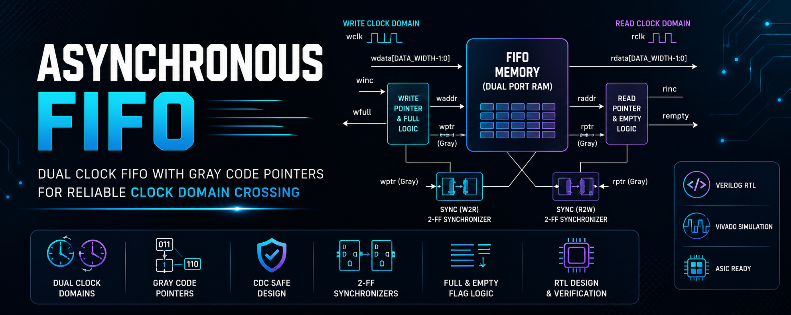
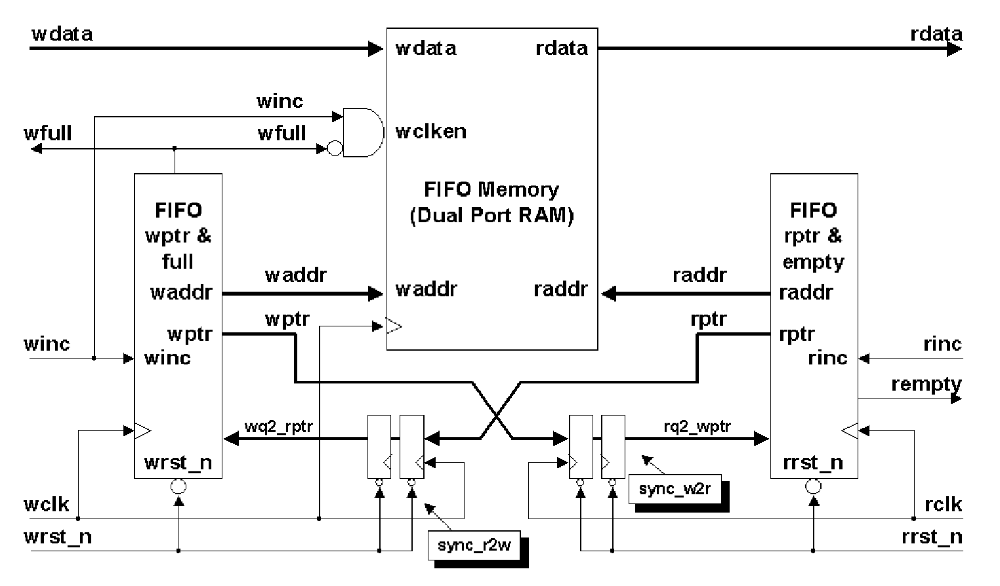
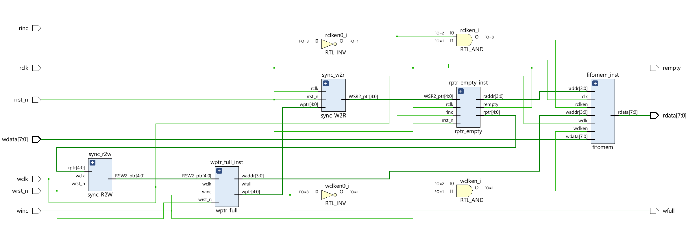
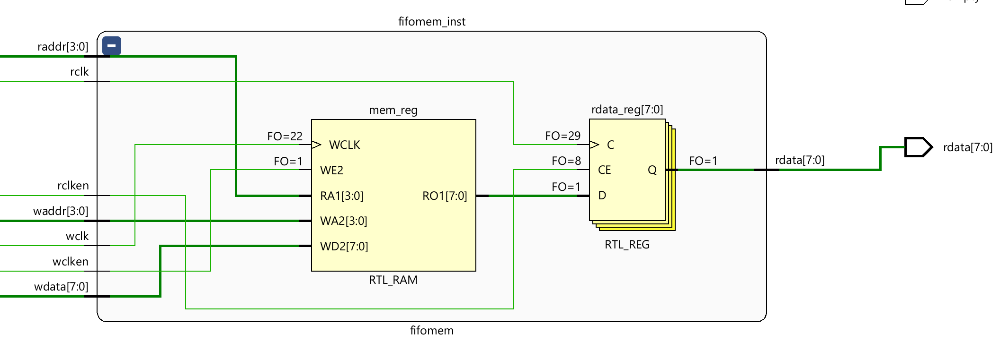
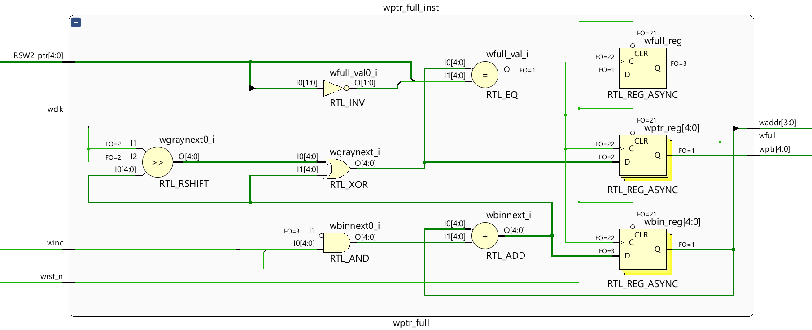
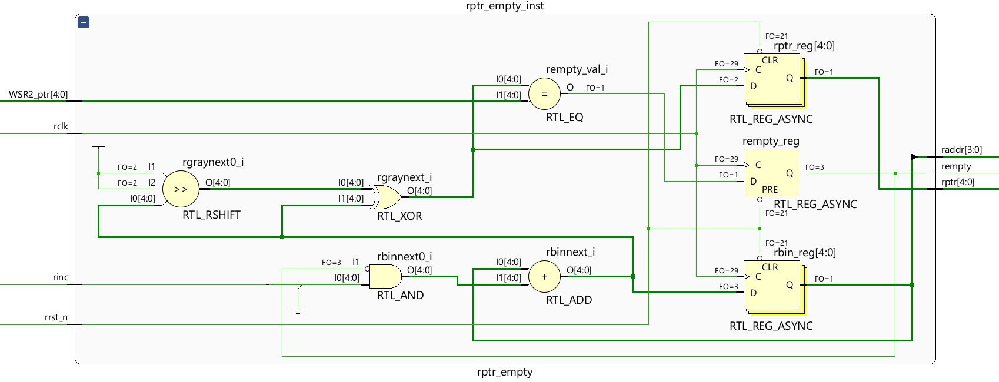
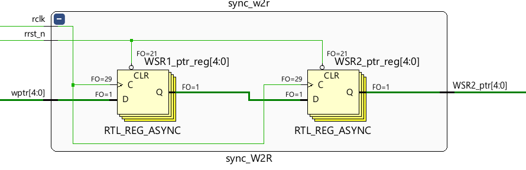
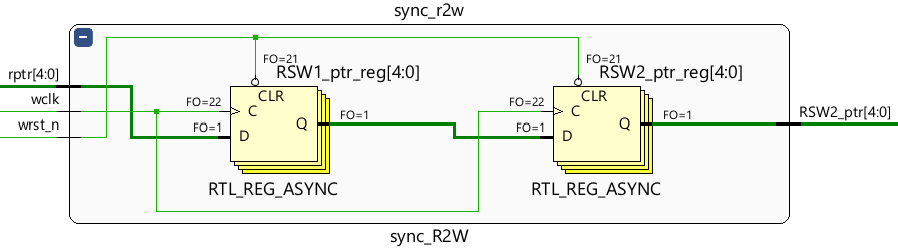
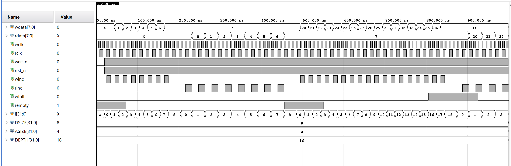

<div align="center">



# Asynchronous FIFO

### Clock Domain Crossing (CDC) using Gray Code Pointers and Two-Flip-Flop Synchronizers


**RTL Design • Functional Verification • Safe Clock Domain Crossing**

</div>

---

# 📖 Overview

This project implements a **parameterized Asynchronous FIFO (First-In First-Out)** in **Verilog HDL** for reliable data transfer between two independent clock domains.

To ensure safe **Clock Domain Crossing (CDC)**, the design employs:

- Gray Code Read/Write Pointers
- Two-Flip-Flop Synchronizers
- Dual-Port FIFO Memory
- Independent Read and Write Clock Domains
- Full and Empty Flag Generation

The design has been functionally verified using **Vivado** with comprehensive test cases covering normal operation, FIFO full, and FIFO empty conditions.

---

# ✨ Project Highlights

- ✅ Parameterized Asynchronous FIFO
- ✅ Independent Read & Write Clock Domains
- ✅ Gray Code Pointer Synchronization
- ✅ Two Flip-Flop Synchronizers
- ✅ Dual-Port FIFO Memory
- ✅ Full & Empty Flag Generation
- ✅ Functional Verification using Vivado
- ✅ Modular RTL Design

---

# 🏗️ Architecture

<p align="center">

</p>

The asynchronous FIFO consists of the following functional blocks:

- FIFO Memory (Dual-Port RAM)
- Write Pointer & Full Detection Logic
- Read Pointer & Empty Detection Logic
- Two-Flip-Flop Synchronizers
- Independent Write and Read Clock Domains

---

# 🧩 Top-Level RTL

<p align="center">

</p>

The top-level module integrates the FIFO memory, pointer generation logic, synchronizers, and flag generation circuitry to enable reliable data transfer across asynchronous clock domains.

---

# 🔩 RTL Modules

## FIFO Memory

<p align="center">

</p>

Implements a **Dual-Port RAM** that allows simultaneous write and read operations using independent clocks.

---

## Write Pointer & Full Detection

<p align="center">

</p>

Responsible for:

- Binary Write Pointer
- Gray Code Conversion
- Write Address Generation
- Full Flag Detection

---

## Read Pointer & Empty Detection

<p align="center">

</p>

Responsible for:

- Binary Read Pointer
- Gray Code Conversion
- Read Address Generation
- Empty Flag Detection

---

## Pointer Synchronization

### Write Pointer → Read Clock Domain

<p align="center">

</p>

### Read Pointer → Write Clock Domain

<p align="center">

</p>

Two-stage synchronizers safely transfer Gray-coded pointers across clock domains, significantly reducing the probability of metastability.

---

# 🔄 Clock Domain Crossing (CDC)

Since the write clock (`wclk`) and read clock (`rclk`) operate independently, directly transferring multi-bit binary pointers may result in metastability and incorrect sampling.

This design ensures reliable CDC by:

- Converting Binary Pointers to Gray Code
- Synchronizing Gray Pointers using Two-Flip-Flop Synchronizers
- Comparing only synchronized pointers for Full/Empty detection

---

# 🌐 Gray Code Synchronization

Gray Code ensures that **only one bit changes between consecutive values**, minimizing the possibility of sampling multiple changing bits simultaneously during clock domain crossing.

This significantly improves synchronization reliability.

---

# ⚠️ Metastability Protection

Metastability is mitigated using **Two-Flip-Flop Synchronizers**.

The first flip-flop may temporarily enter a metastable state, while the second flip-flop captures a stable value in the following clock cycle, preventing metastability from propagating into functional logic.

---

# 🧪 Functional Verification

The asynchronous FIFO was verified using a Verilog testbench in **Vivado**.

### Verification Scenarios

- Normal Write and Read Operation
- FIFO Full Condition
- FIFO Empty Condition
- Independent Read and Write Clocks
- Data Integrity Verification

<p align="center">

</p>

The waveform demonstrates:

- Correct FIFO ordering
- Safe data transfer across asynchronous clock domains
- Proper assertion of `wfull`
- Proper assertion of `rempty`
- Synchronization delay introduced by Gray Code pointer synchronization

---

# 📂 Repository Structure

```text
.
├── rtl/
│   ├── async_fifo.v
│   ├── fifo_memory.v
│   ├── wptr_full.v
│   ├── rptr_empty.v
│   ├── sync_w2r.v
│   └── sync_r2w.v
│
├── testbench/
│   └── async_fifo_tb.v
│
├── docs/
│   ├── banner.png
│   ├── async_fifo_architecture.png
│   ├── async_fifo_top.png
│   ├── fifo_memory.png
│   ├── wptr_full.png
│   ├── rptr_empty.png
│   ├── two_ff_sync_w2r.png
│   ├── two_ff_sync_r2w.png
│   └── simulation_waveform.png
│
├── reports/
├── LICENSE
└── README.md
```

---

# 🚀 Future Enhancements

- RTL-to-GDSII Implementation using OpenLane
- Static Timing Analysis (STA)
- Physical Design Flow
- DRC/LVS Verification
- FPGA Implementation
- UVM-Based Verification Environment

---

# 🛠️ Tools Used

- Verilog HDL
- Xilinx Vivado
- GTKWave
- VS Code

---

# 👨‍💻 Developer

**Saabiq U A**

B.E. Electronics and Communication Engineering  
**College of Engineering Guindy (Anna University)**

### Areas of Interest

- RTL Design
- Digital System Design
- Clock Domain Crossing (CDC)
- ASIC Physical Design
- RISC-V Processor Design

---

<div align="center">

### ⭐ If you found this project useful, consider giving it a Star!

Designed and verified using **Verilog HDL** and **Vivado**

</div>