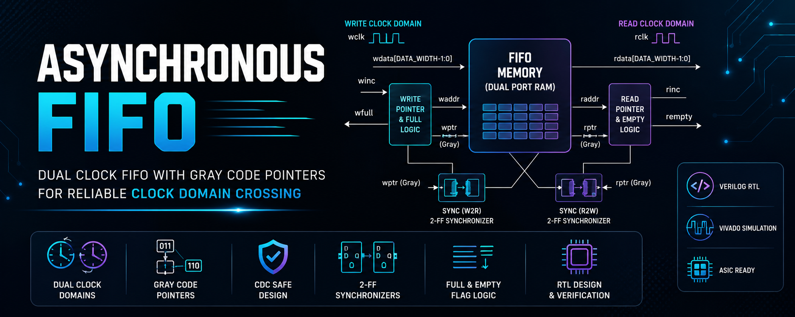
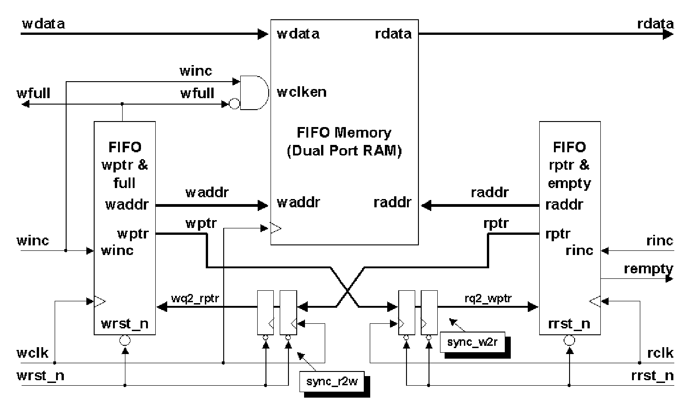
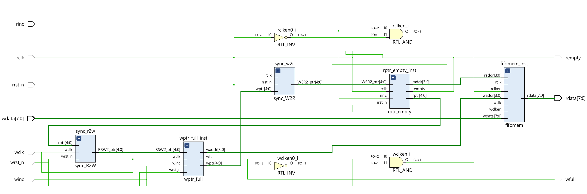
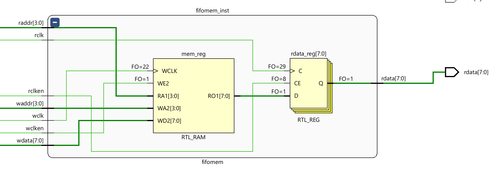
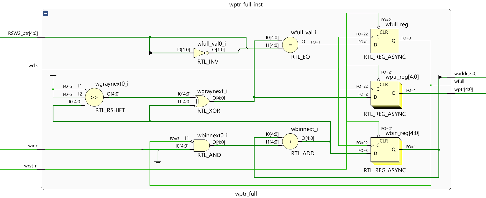
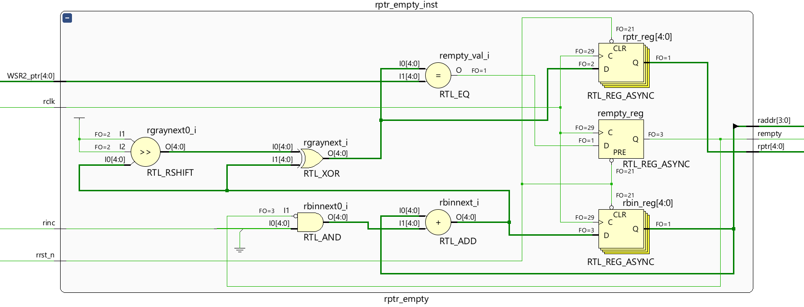
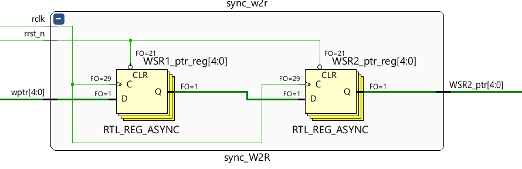
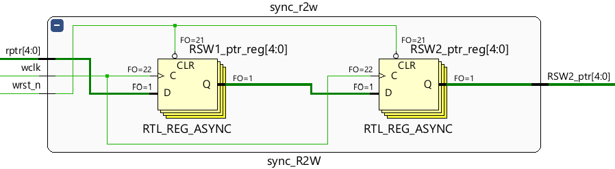
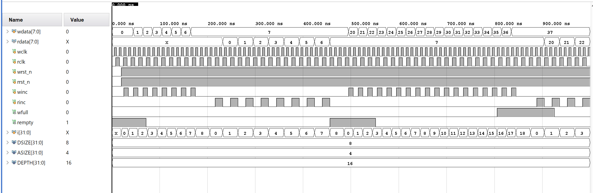
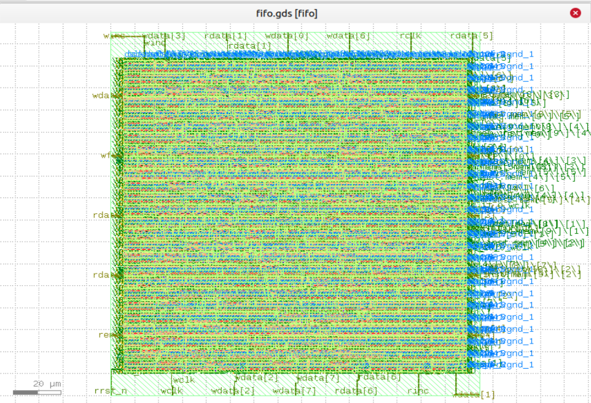

<div align="center">



# Asynchronous FIFO

### Clock Domain Crossing (CDC) using Gray Code Pointers and Two-Flip-Flop Synchronizers


**RTL Design • Functional Verification • Safe Clock Domain Crossing • ASIC Physical Design**

</div>

---

# 📖 Overview

This project implements a **parameterized Asynchronous FIFO (First-In First-Out)** in **Verilog HDL** for reliable data transfer between two independent clock domains.

To ensure safe **Clock Domain Crossing (CDC)**, the design employs:

* Gray Code Read/Write Pointers
* Two-Flip-Flop Synchronizers
* Dual-Port FIFO Memory
* Independent Read and Write Clock Domains
* Full and Empty Flag Generation

The design has been functionally verified using **Vivado** with test cases covering normal operation, FIFO full, and FIFO empty conditions.

After functional verification, the RTL design was taken through an **RTL-to-GDSII ASIC implementation flow using OpenLane with the SKY130A 130 nm PDK**.

The project therefore covers the complete flow from **RTL design and verification to physical implementation and final GDSII generation**.

---

# ✨ Project Highlights

* ✅ Parameterized Asynchronous FIFO
* ✅ Independent Read & Write Clock Domains
* ✅ Gray Code Pointer Synchronization
* ✅ Two-Flip-Flop Synchronizers
* ✅ Dual-Port FIFO Memory
* ✅ Full & Empty Flag Generation
* ✅ Functional Verification using Vivado
* ✅ Modular RTL Design
* ✅ RTL-to-GDSII Implementation using OpenLane
* ✅ SKY130A 130 nm Technology
* ✅ Static Timing Analysis
* ✅ Antenna Diode Insertion
* ✅ DRC Verification
* ✅ LVS Verification
* ✅ Antenna Verification
* ✅ Final GDSII Generation

---

# 🏗️ Architecture

<p align="center">
  
</p>

The asynchronous FIFO consists of the following functional blocks:

* FIFO Memory (Dual-Port RAM)
* Write Pointer & Full Detection Logic
* Read Pointer & Empty Detection Logic
* Two-Flip-Flop Synchronizers
* Independent Write and Read Clock Domains

---

# 🧩 Top-Level RTL

<p align="center">
  
</p>

The top-level module integrates the FIFO memory, pointer generation logic, synchronizers, and flag generation circuitry to enable reliable data transfer across asynchronous clock domains.

---

# 🔩 RTL Modules

## FIFO Memory

<p align="center">
  
</p>

Implements a **Dual-Port RAM** that allows simultaneous write and read operations using independent clocks.

---

## Write Pointer & Full Detection

<p align="center">
  
</p>

Responsible for:

* Binary Write Pointer
* Gray Code Conversion
* Write Address Generation
* Full Flag Detection

---

## Read Pointer & Empty Detection

<p align="center">
  
</p>

Responsible for:

* Binary Read Pointer
* Gray Code Conversion
* Read Address Generation
* Empty Flag Detection

---

## Pointer Synchronization

### Write Pointer → Read Clock Domain

<p align="center">
  
</p>

### Read Pointer → Write Clock Domain

<p align="center">
  
</p>

Two-stage synchronizers safely transfer Gray-coded pointers across clock domains, significantly reducing the probability of metastability propagating into the destination domain.

---

# 🔄 Clock Domain Crossing (CDC)

Since the write clock (`wclk`) and read clock (`rclk`) operate independently, directly transferring multi-bit binary pointers across clock domains can result in metastability and incorrect sampling.

This design ensures reliable CDC by:

1. Converting Binary Pointers to Gray Code
2. Synchronizing Gray Pointers using Two-Flip-Flop Synchronizers
3. Comparing only synchronized pointers for Full/Empty detection

---

# 🌐 Gray Code Synchronization

Gray Code ensures that **only one bit changes between consecutive values**, minimizing the possibility of sampling multiple changing bits simultaneously during clock domain crossing.

This makes Gray-coded pointers suitable for safely communicating FIFO state information between asynchronous clock domains.

---

# ⚠️ Metastability Protection

Metastability is mitigated using **Two-Flip-Flop Synchronizers**.

The first flip-flop may temporarily enter a metastable state, while the second flip-flop captures the synchronized value in the following clock cycle, reducing the probability of metastability propagating into the functional logic.

---

# 🧪 Functional Verification

The asynchronous FIFO was verified using a Verilog testbench in **Vivado**.

## Verification Scenarios

* Normal Write and Read Operation
* FIFO Full Condition
* FIFO Empty Condition
* Independent Read and Write Clocks
* Data Integrity Verification

<p align="center">
  
</p>

The waveform demonstrates:

* Correct FIFO ordering
* Safe data transfer across asynchronous clock domains
* Proper assertion of `wfull`
* Proper assertion of `rempty`
* Synchronization delay introduced by Gray Code pointer synchronization

---

# ⚙️ ASIC Implementation using OpenLane

After functional verification, the RTL was implemented using **OpenLane** targeting the **SKY130A 130 nm open-source PDK**.

The physical-design flow was carried out from RTL synthesis through final GDSII generation.

## Technology Configuration

| Parameter               | Value             |
| ----------------------- | ----------------- |
| ASIC Flow               | OpenLane          |
| PDK                     | SKY130A           |
| Technology              | 130 nm            |
| Standard Cell Library   | `sky130_fd_sc_hd` |
| Clock Period            | 10 ns             |
| Target Frequency        | 100 MHz           |
| Target Core Utilization | 40%               |
| Antenna Diode Insertion | Enabled           |

---

# 🔧 RTL-to-GDSII Flow

```text
RTL Design
    │
    ▼
Synthesis
    │
    ▼
Floorplanning
    │
    ▼
Placement
    │
    ▼
Clock Tree Synthesis
    │
    ▼
Antenna Diode Insertion
    │
    ▼
Global Routing
    │
    ▼
Detailed Routing
    │
    ▼
Parasitic Extraction
    │
    ▼
Static Timing Analysis
    │
    ▼
DRC / LVS / Antenna / XOR
    │
    ▼
Final GDSII
```

The flow transforms the synthesized RTL into a physically implemented standard-cell design and ultimately produces the final **GDSII layout database**.

---

# 📐 Physical Design Results

The final physical implementation generated the GDSII layout for the asynchronous FIFO.

<p align="center">
  
</p>

The layout represents the physical implementation of the FIFO design using the SKY130 standard-cell technology.

---

## 📊 Implementation Results

For detailed synthesis, timing, placement, routing, and physical verification results, see the **[OpenLane Implementation Report](reports/openlane_results.md)**.

The report contains information related to:

* Synthesis
* Floorplanning
* Placement
* Routing
* Static Timing Analysis
* Physical Verification
* GDSII Generation

---

# 📂 Repository Structure

```text
.
├── rtl/
│   ├── fifo_top.v
│   ├── fifomem.v
│   ├── wptr_full.v
│   ├── rptr_empty.v
│   ├── sync_w2r.v
│   └── sync_r2w.v
│
├── testbench/
│   └── tb_async_fifo.v
│
├── docs/
│   ├── banner.png
│   ├── async_fifo_architecture.png
│   ├── async_fifo_top.png
│   ├── fifo_memory.png
│   ├── wptr_full.png
│   ├── rptr_empty.png
│   ├── two_ff_sync_w2r.png
│   ├── two_ff_sync_r2w.png
│   ├── simulation_waveform.png
│   └── gds_layout.png
│
├── openlane/
│   ├── config.json
│   └── async_fifo.sdc
│
├── results/
│   └── fifo.gds
│
├── reports/
│   └── OpenLane_results.md
│
├── LICENSE
└── README.md
```

---

# 🛠️ Tools & Technologies

### RTL Design

* Verilog HDL
* Vivado

### Functional Verification

* Vivado Simulator
* Verilog Testbench

### ASIC Physical Design

* OpenLane
* Yosys
* OpenROAD
* Magic
* Netgen
* SKY130A PDK

### Technology

* SkyWater SKY130
* `sky130_fd_sc_hd` Standard Cell Library

---

# 📚 Key Concepts Demonstrated

This project demonstrates practical implementation of:

* Asynchronous FIFO Architecture
* Clock Domain Crossing
* Gray Code Counters
* Metastability Mitigation
* Two-Flip-Flop Synchronization
* FIFO Full/Empty Detection
* Dual-Port Memory
* RTL Functional Verification
* Logic Synthesis
* Floorplanning
* Placement
* Clock Tree Synthesis
* Antenna Diode Insertion
* Global and Detailed Routing
* Parasitic Extraction
* Static Timing Analysis
* DRC
* LVS
* Antenna Verification
* GDSII Generation

---

# 🚀 Future Improvements

Potential future improvements include:

* Parameterized FIFO data width and depth
* Additional constrained-random verification
* SystemVerilog assertions for CDC and FIFO properties
* Formal verification of FIFO control logic
* Timing optimization and improved timing closure
* Power analysis
* Area and power optimization
* Further physical-design optimization

---

# 👨‍💻 Developer

**Saabiq U A**

B.E. Electronics and Communication Engineering
**College of Engineering Guindy (Anna University)**

### Areas of Interest

* RTL Design
* Digital System Design
* Clock Domain Crossing (CDC)
* ASIC Physical Design
* RISC-V Processor Design

---

# 📄 License

This project is licensed under the **MIT License**.

See the `LICENSE` file for more information.

---
